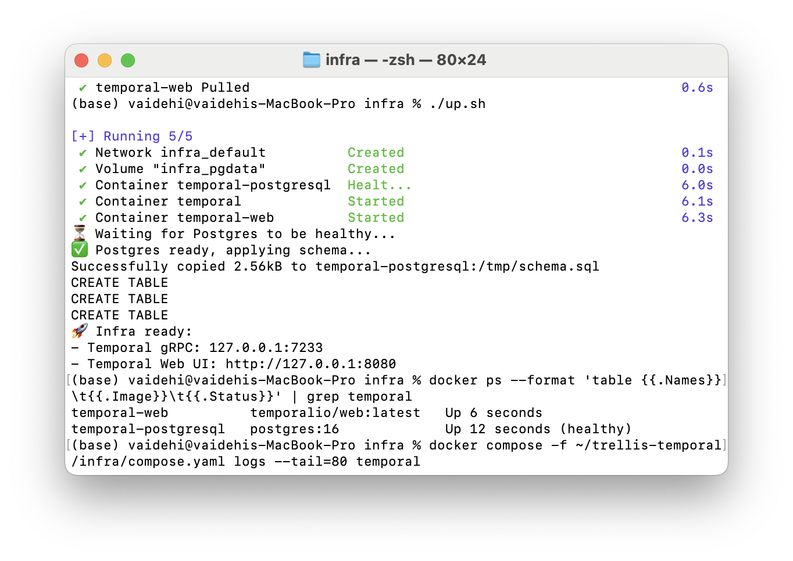
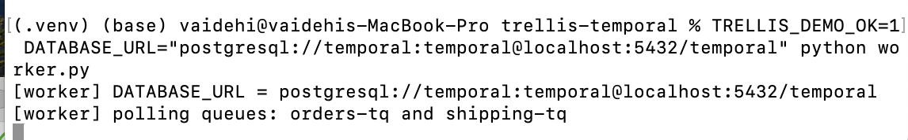
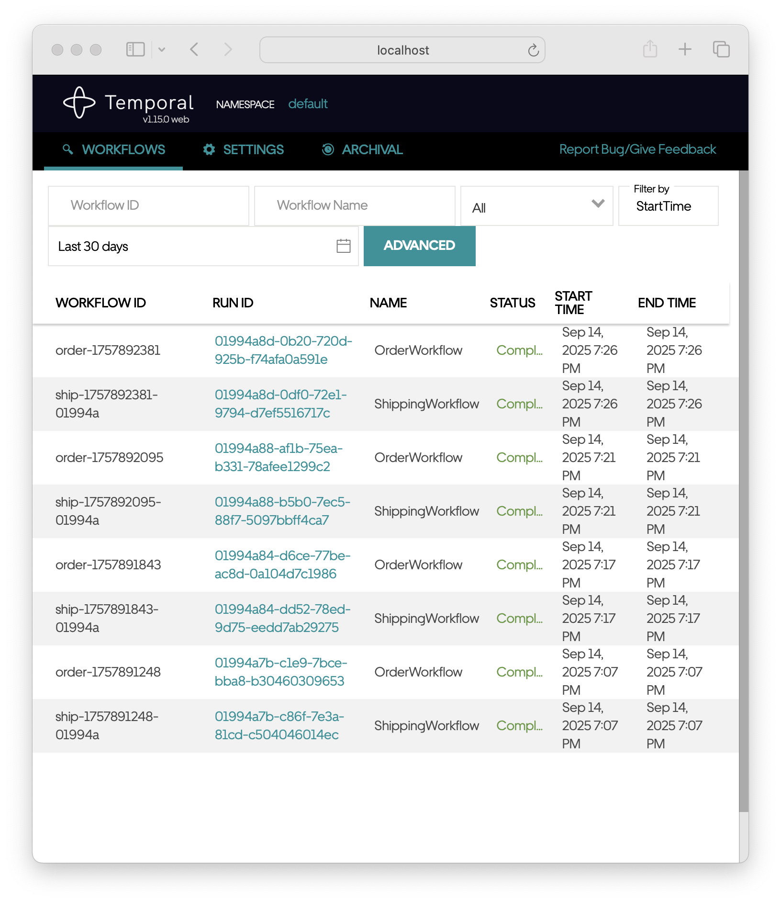
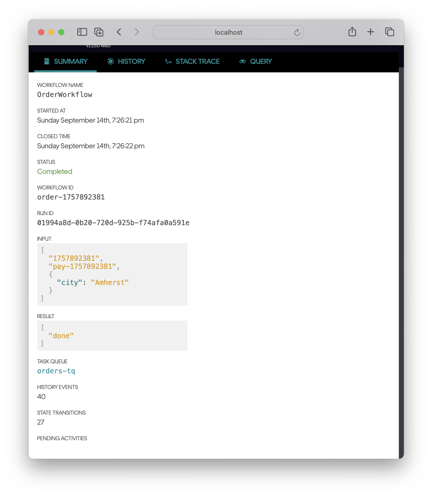
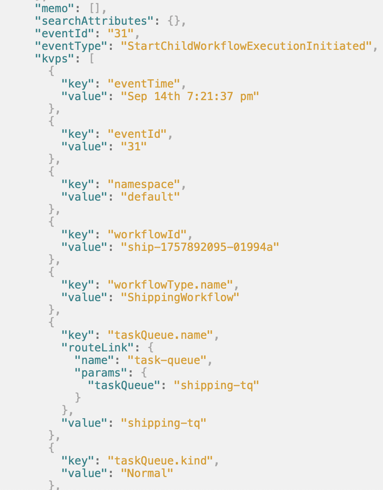
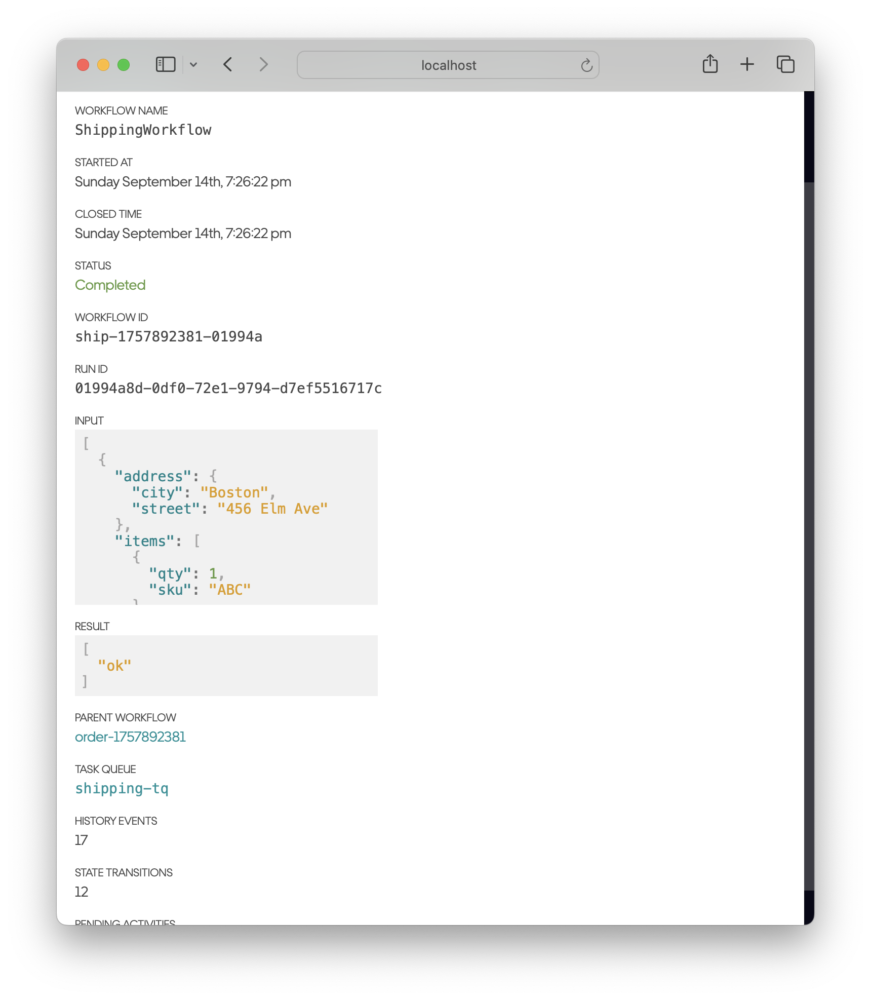
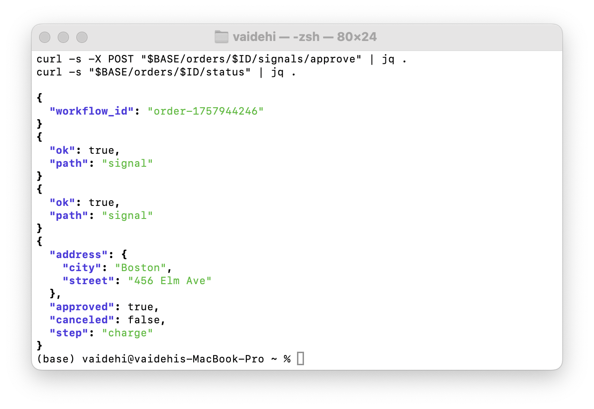
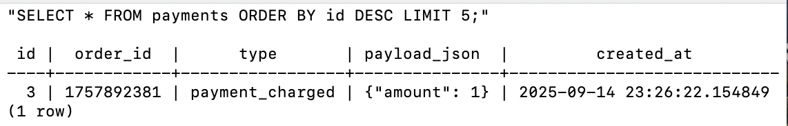
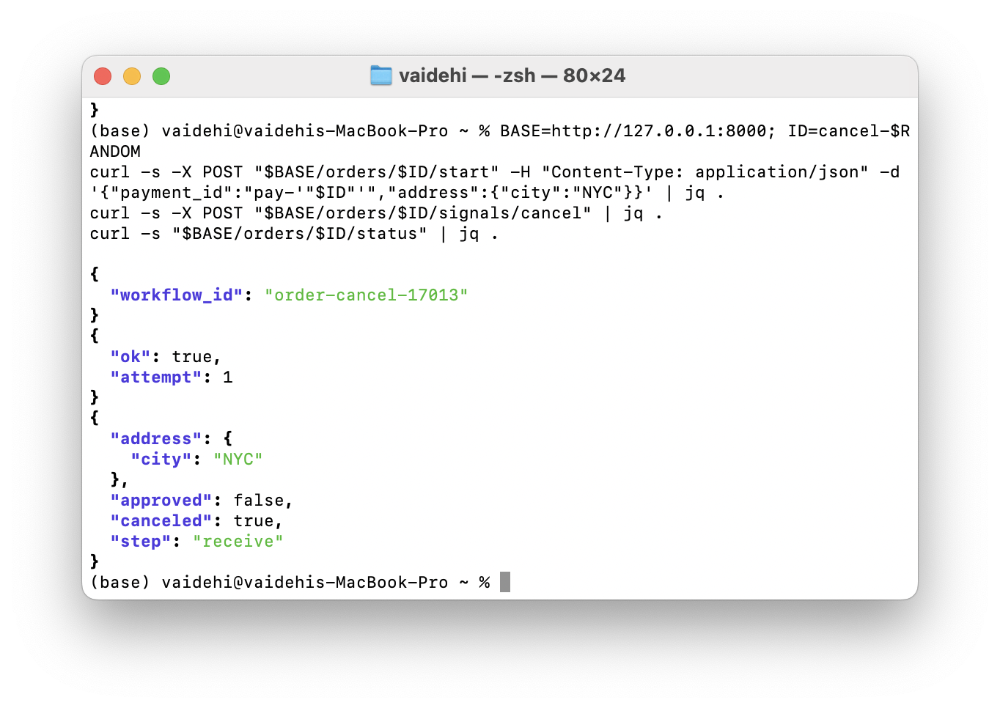

<!-- docs/DEMO-WALKTHROUGH.md -->
# Demo Walkthrough

This walkthrough shows the system running end-to-end with screenshots from Temporal Web, API output, and DB verification.

---

When the infrastructure is up, Temporal Web lists both the **OrderWorkflow** (parent) and **ShippingWorkflow** (child). The worker is polling both `orders-tq` and `shipping-tq`, so as soon as an order is placed both workflows are present.

  
  

---

The order summary shows signals being processed — address update, approve, and eventually a successful completion. In the history you can see the **StartChildWorkflowExecutionInitiated** event, which triggers the child shipping workflow.

  
  

---

During a normal “happy path,” the API logs and Temporal Web confirm the order is approved, the charge recorded, and the shipping dispatched. The events table in Postgres contains the audit trail of workflow events.

  

---

In the cancel variant, the workflow moves into a **TimedOut** state after cancellation. This is the current intended behavior: cancel signals are honored, but the short run timeout (15s) means the order times out soon after.

---

Retries were configured for the shipping child: if dispatch fails, the parent retries once. In this demo run it succeeded on the first attempt, but the workflow definition ensures retry is covered.
